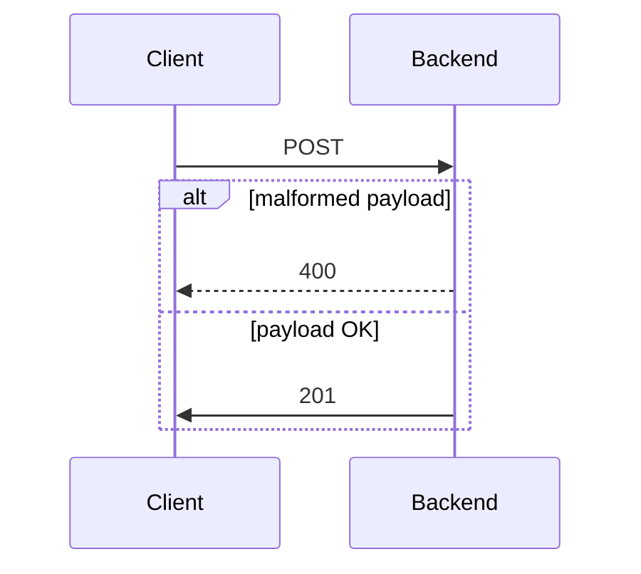

# RESTful API with ASP.NET Core

## Project description

Web service provides endpoints to create accounts and manage transactions.


## Architecture



## Usage

### Create account
#### Payload
```json
{
  "accountId": "ff41eeb4-ea40-4c85-b7f5-272ccb511527",
  "Balance": 500000
}
```

#### Response
```json
{
    "status": 201
}
```

#### POST using terminal

```bash
curl -X 'POST' \
  'http://localhost:5231/api/Accounts' \
  -H 'accept: text/plain' \
  -H 'Content-Type: application/json' \
  -d '{
  "id": "ff41eeb4-ea40-4c85-b7f5-272ccb511527",
  "balance": 0
}'
```

### Manage transaction
#### Payload
```json
{
  "accountId": "ff41eeb4-ea40-4c85-b7f5-272ccb511527",
  "amount": 500000
}
```

#### Response
```json
{
    "status": 201
}
```

#### POST using terminal

```bash
curl -X 'POST' \
  'http://localhost:5231/api/Transactions' \
  -H 'accept: */*' \
  -H 'Content-Type: application/json' \
  -d '{
  "accountId": "ff41eeb4-ea40-4c85-b7f5-272ccb511527",
  "amount": 500000
}'
```

### Execution

```bash
gh repo clone sauravdwivedi/Microservices
cd Microservices && cd ASP.NET && cd TransactionManagement
# Create database schema
dotnet ef migrations add InitialModel
# Create database 
dotnet ef database update
# Run the web service
dotnet run
```

### Swagger UI

- http://localhost:5231/swagger/index.html

### Tutorials 

- https://learn.microsoft.com/en-us/aspnet/core/tutorials/first-web-api
- https://learn.microsoft.com/en-us/ef/core/modeling/relationships/one-to-many
- https://learn.microsoft.com/en-us/aspnet/core/fundamentals/error-handling
  