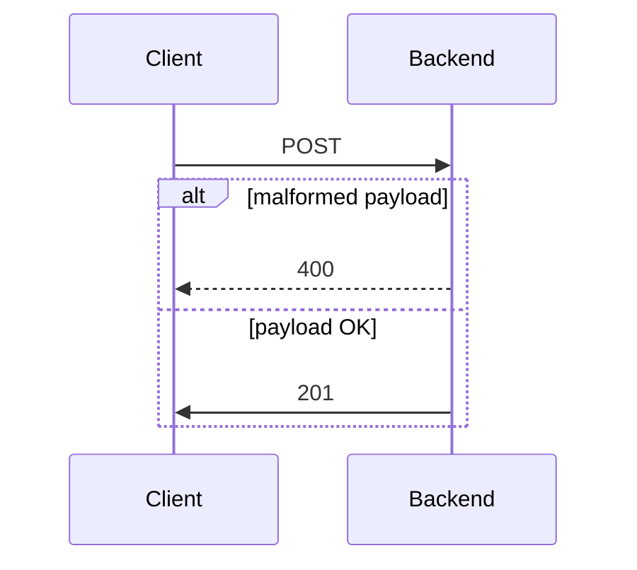

# Java Spring Boot application "Cat Breeds API"

## Project description

Web service provides endpoints to execute CRUD operations.


## Architecture



## Usage

### Query cat breeds

#### GET all cat breeds using terminal
```bash
curl -X 'GET' \
  'http://localhost:8080/api/v1/breeds/' \
  -H 'accept: */*'
```

#### Response
```json
[
  {
    "id": "26573fdd-b03d-440a-91f9-9e38f9902c09",
    "breed": "Abyssinian",
    "origin": "Unspecified, but somewhere in Afro-Asia, likely Ethiopia",
    "type": "natural",
    "type_info": null,
    "body_types": [
      "semi-foreign"
    ],
    "coat_type_and_length": "short",
    "coat_pattern": "Ticked tabby"
  },
  .
  .
  .
]
```

#### GET cat breed by id using terminal
```bash
curl -X 'GET' \
  'http://localhost:8080/api/v1/breeds/26573fdd-b03d-440a-91f9-9e38f9902c09' \
  -H 'accept: */*'
```

#### Response
```json
{
  "id": "26573fdd-b03d-440a-91f9-9e38f9902c09",
  "breed": "Abyssinian",
  "origin": "Unspecified, but somewhere in Afro-Asia, likely Ethiopia",
  "type": "natural",
  "type_info": null,
  "body_types": [
    "semi-foreign"
  ],
  "coat_type_and_length": "short",
  "coat_pattern": "Ticked tabby"
}
```

#### GET cat breed by breed and/or origin using terminal
```bash
curl -X 'GET' \
  'http://localhost:8080/api/v1/breeds?origin=Greece' \
  -H 'accept: */*'
```

#### Response
```json
[
  {
    "id": "be6ee300-edf3-4a9d-82c2-90fd14ea6c78",
    "breed": "Aegean",
    "origin": "Greece",
    "type": "natural",
    "type_info": null,
    "body_types": [
      "moderate"
    ],
    "coat_type_and_length": "semi-long",
    "coat_pattern": "Multi-color"
  }
]
```

### Create record for kitten

#### POST using terminal

```bash
curl -X 'POST' \
  'http://localhost:8080/api/v1/kittens' \
  -H 'accept: */*' \
  -H 'Content-Type: application/json' \
  -d '{
"breed_id": "870b03a1-8435-4324-b2a7-bcccdc290ffb",
"name": "Katy Purry Meowise"
}'
```

#### Response 
```json
{
  "message": "No such breed",
  "status": 400
}
```

### Execution

```bash 
gh repo clone sauravdwivedi/Microservices
cd Microservices && cd Java && cd cat-breeds-api
./gradlew bootRun
```

### Swagger UI

- http://localhost:8080/swagger-ui/index.html