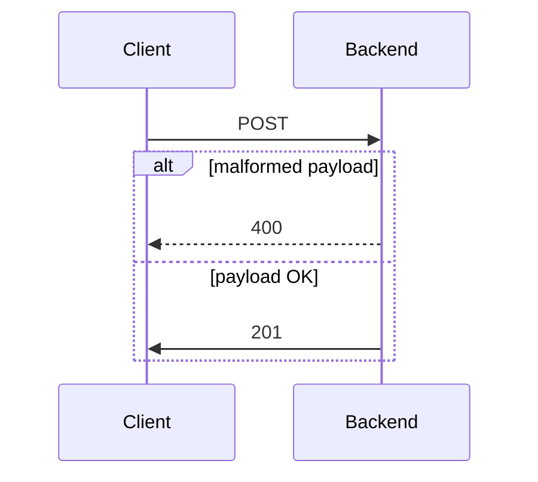

# Kotlin Spring Boot application "Conference Room Booking API"

## Project description
Web service provides endpoints to execute CRUD operations.


## Architecture



## Usage

### Create employee
#### Payload
```json
{
  "name": "Joe",
  "email": "joe@companyxyz.com",
  "employer": "Company XYZ"
}
```

#### Response
```json
{
  "id": 1,
  "name": "Joe",
  "email": "joe@companyxyz.com",
  "employer": "Company XYZ"
}
```

#### POST using terminal

```bash
curl -X 'POST' \
  'http://localhost:8080/api/v1/employees' \
  -H 'accept: */*' \
  -H 'Content-Type: application/json' \
  -d '{
  "name": "Joe",
  "email": "joe@companyxyz.com",
  "employer": "Company XYZ"
}'
```

### Create Booking

#### POST using terminal

```bash
curl -X 'POST' \
  'http://localhost:8080/api/v1/bookings' \
  -H 'accept: */*' \
  -H 'Content-Type: application/json' \
  -d '{
  "employeeId": 1,
  "checkIn": "2024-10-29T08:07:19.811Z",
  "checkOut": "2024-10-29T12:07:19.811Z"
}'
```

### Cancel Booking

#### PATCH using terminal

```bash
curl -X 'PATCH' \
  'http://localhost:8080/api/v1/bookings' \
  -H 'accept: */*' \
  -H 'Content-Type: application/json' \
  -d '{
  "bookingId": 1
}'
```

## Execution

### Run MySQL instance on docker

```bash
docker run --name mysql -p 3306:3306 -e MYSQL_ROOT_PASSWORD=my-secret-pw -d mysql
```

### Create database

```bash
docker exec -it mysql bash
mysql -u root -p
# Use password 'my-secret-pw'
create database conference_room_booking;
```
 
### Run spring boot application

```bash 
gh repo clone sauravdwivedi/Microservices
cd Microservices && cd Kotlin && cd conference-room-booking-api
./gradlew --info bootRun
```

### Swagger UI

- http://localhost:8080/swagger-ui/index.html

### Tutorials

- https://spring.io/guides/tutorials/spring-boot-kotlin
- https://kotlinlang.org/docs/jvm-get-started-spring-boot.html
- https://kotlinlang.org/docs/jvm-spring-boot-using-crudrepository.html
- https://spring.io/guides/gs/validating-form-input