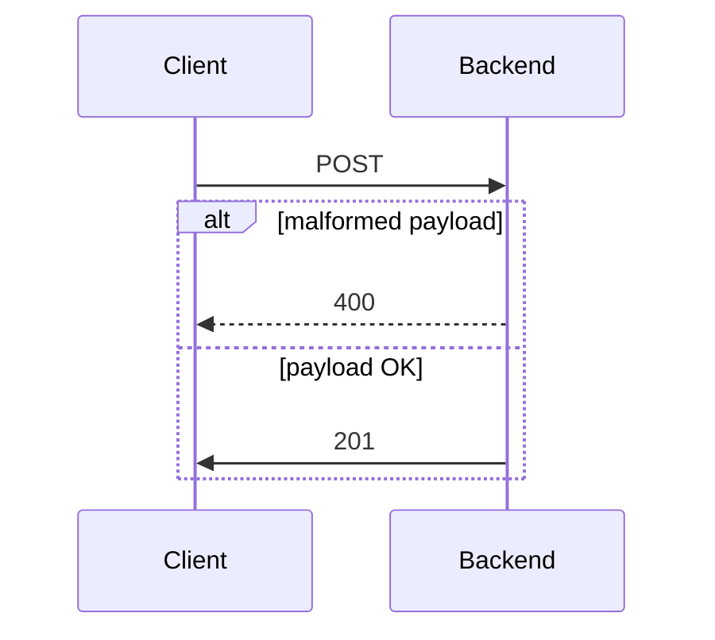

# Kotlin Spring Boot application Transaction Management API

## Project description
Web service provides endpoints to execute CRUD operations.


## Architecture



## Usage

### Create account
#### Payload
```json
{
  "Id": "ff41eeb4-ea40-4c85-b7f5-272ccb511527",
  "Balance": 500000
}
```

#### Response
```json
{
    "status": 201
}
```

#### POST using terminal

```bash
curl -X 'POST' \
  'http://localhost:8080/api/v1/accounts' \
  -H 'accept: text/plain' \
  -H 'Content-Type: application/json' \
  -d '{
  "id": "ff41eeb4-ea40-4c85-b7f5-272ccb511527",
  "balance": 0
}'
```

## Execution

### Run MySQL instance on docker

```bash
docker run --name mysql -p 3306:3306 -e MYSQL_ROOT_PASSWORD=my-secret-pw -d mysql
```
 
### Run spring boot application

```bash 
gh repo clone sauravdwivedi/Microservices
cd Microservices && cd Kotlin && cd transaction-management-api
./gradlew --debug bootRun
```

### Swagger UI

- http://localhost:8080/swagger-ui/index.html

### Tutorials

- https://kotlinlang.org/docs/jvm-get-started-spring-boot.html
- https://kotlinlang.org/docs/jvm-spring-boot-using-crudrepository.html