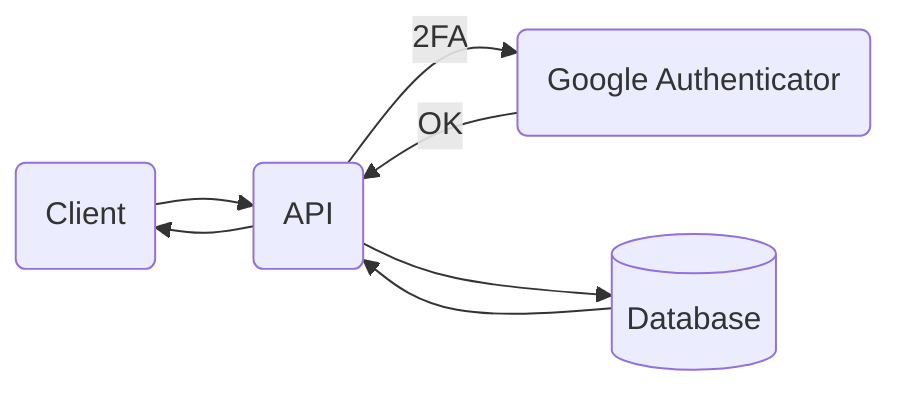
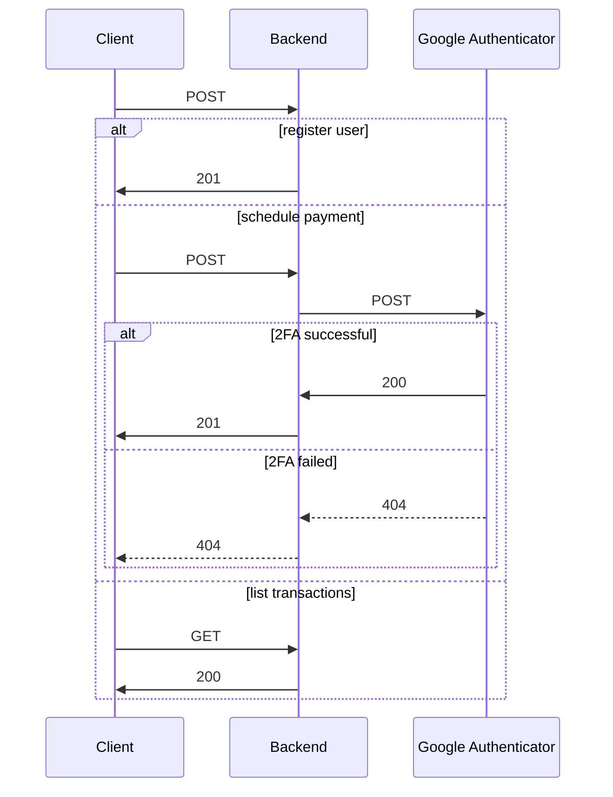

# RESTful API with 2FA using Google Authenticator app

## Project description



Flask application with endpoints:

- /api/v1/user/register
- /api/v1/schedule/payment
- /api/v1/transactions

Endpoint /api/v1/user/register allows to create users using POST method. Endpoint /api/v1/schedule/payment allows to send payment info via POST method while sending auth verification to Google authenticator app. Enpoint /api/v1/transactions lists all succesfull transactions (i.e. Google authenticator app authenticated) using GET method. Endpoint /api/v1/schedule/payment example:

### Payload
```json
{
    "user": "Smith", 
    "ammount": 1032423424.23,
    "transaction_type": "deposit",
    "status": "scheduled",
    "pin": "815587"
}
```

### Response
```json
{
    "status": "Google 2FA authentication successful. Transaction processed!"
}
```



## Execution

### Clone repository 

```bash
gh repo clone sauravdwivedi/Microservices
cd Microservices && cd Python && cd Flask && cd RESTful-API-with-2FA
```

### Run on Docker

```bash
docker compose up -d
curl localhost:8000
```

<details><summary><h3>Run on terminal</h3></summary>
<p>

Setup database

```bash
docker pull mysql
docker run --name mysql -p 3306:3306 -e MYSQL_ROOT_PASSWORD=my-secret-pw -e MYSQL_DATABASE=flask_app -d mysql
```
  
```bash
python3 -m venv google_auth
source google_auth/bin/activate
source secrets
source .env
pip3 install -r requirements.txt
flask db init 
flask db migrate -m "Initial migration"
flask db upgrade
flask run --host=0.0.0.0 --port=8000
```

</p>
</details>


### Set Google Autheticator app

Download Google Authenticator app. For more info visit:

- https://authenticatorapi.com/

Open the app and scan QR code:


### Test endpoints

Use PIN displayed in Google Authenticator app to test endpoint /schedule/payment.

```bash
curl http://127.0.0.1:8000/api/v1/user/register \
    --include \
    --header "Content-Type: application/json" \
    --request "POST" \
    --data '{"username": "smith_agent", "password": "cerqwfvafc", "name": "Agent Smith"}'
```

```bash
curl http://127.0.0.1:8000/api/v1/schedule/payment \
    --include \
    --header "Content-Type: application/json" \
    --request "POST" \
    --data '{"user": "Smith", "amount": 1032423424, "transaction_type": "deposit", "status": "scheduled", "pin": "<from-google-auth-app>"}'
```

```bash
curl http://127.0.0.1:8000/api/v1/transactions \
    --include \
    --request "GET"
```

### API documentation

- http://127.0.0.1:8000/api/v1/swagger-ui
- http://127.0.0.1:8000/api/v1/redoc
- http://127.0.0.1:8000/api/v1/rapidoc